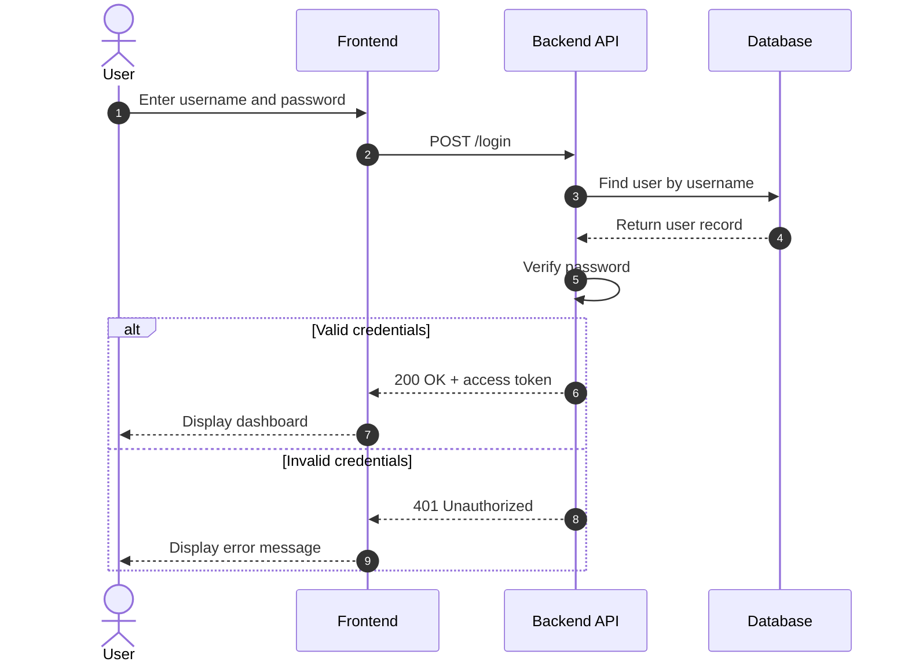

# User Authentication Flow

Here is an example of a Mermaid sequence diagram:

```mermaid
sequenceDiagram
    autonumber
    actor User
    participant UI as Frontend
    participant API as Backend API
    participant DB as Database

    User->>UI: Enter username and password
    UI->>API: POST /login
    API->>DB: Find user by username
    DB-->>API: Return user record
    API->>API: Verify password

    alt Valid credentials
        API-->>UI: 200 OK + access token
        UI-->>User: Display dashboard
    else Invalid credentials
        API-->>UI: 401 Unauthorized
        UI-->>User: Display error message
    end
```

The diagram above is rendered natively; the raw Mermaid source is not shown.
